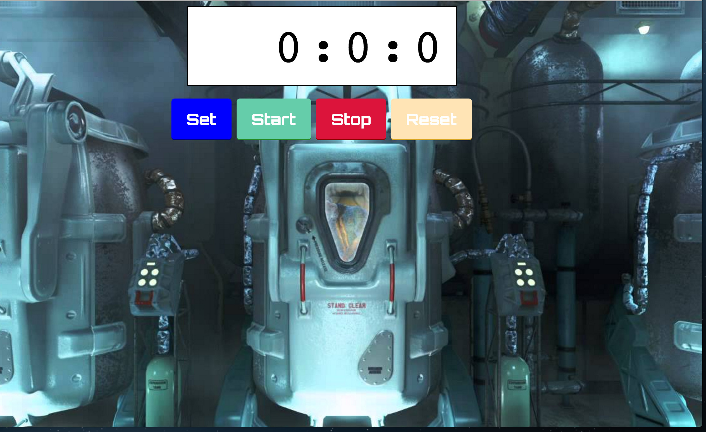

# A man out of time!

##Welcome to vault 111, you are the overseer, it is your job to manage the people in the vault, ah-oh looks like your vault dwellers are all frozen. 

It is your job to keep them frozen, and get them out of the stasis if needed, but you will need something to do all that.

* Make a stopwatch in the browser using JavaScript!

### Learning Objectives

* Get reps with [setInterval](https://developer.mozilla.org/en-US/docs/Web/API/WindowTimers/setInterval#Example) and [clearInterval](https://developer.mozilla.org/en-US/docs/Web/API/WindowTimers/clearInterval)

### Create the HTML and CSS to look like this

### User Stories

####
* As the overseer, I want a button that when clicked, prompts me for an amount of time in minutes to freeze my vault dweller, the clock will count down until the time left is zero and an alert will come up telling me cryogenic stasis is over and the vault dweller is free to comeout.

* As the overseer, I want a button, when clicked starts a stopwatch to count timed passed second by second, so that I can track time passage.

* As the overseer, I want to stop the stopwatch, when clicked starts it backup whenever I want.

* As the overseer, I want a button, when clicked to reset the stopwatch so that I can start counting again from 0.

***Bonus 

Create a new button called "DueDate", when clicked lets you enter a date in the future, it calculates the time difference between current time and the date in the future and counts down to that time, the function created for this new date must be able to account for a date at least 10 years in the future, for example the date you can enter that works would be 10/23/2098.

